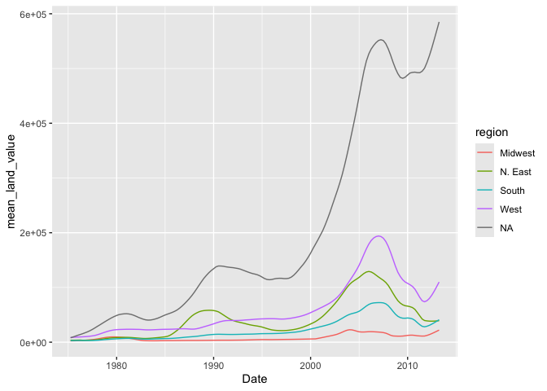
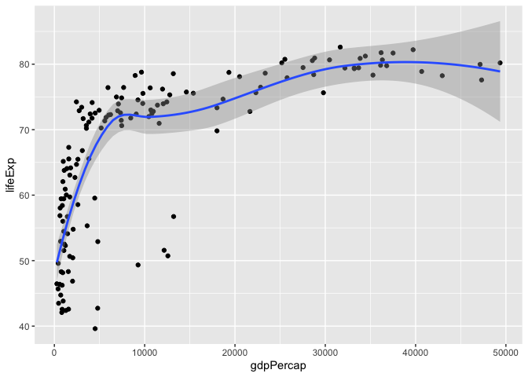
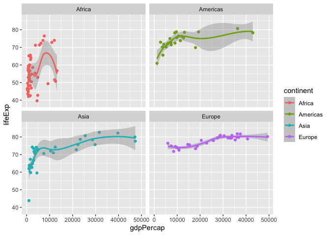
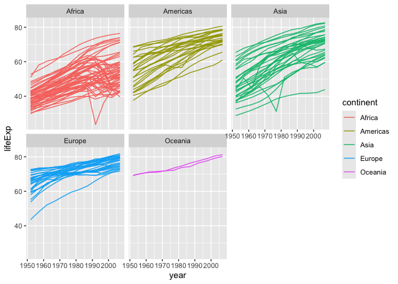
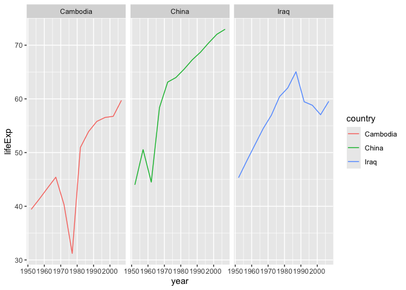

# assignment-5


``` r
library(tidyverse)
```

    ── Attaching core tidyverse packages ──────────────────────── tidyverse 2.0.0 ──
    ✔ dplyr     1.1.4     ✔ readr     2.1.5
    ✔ forcats   1.0.0     ✔ stringr   1.5.1
    ✔ ggplot2   3.5.2     ✔ tibble    3.3.0
    ✔ lubridate 1.9.4     ✔ tidyr     1.3.1
    ✔ purrr     1.1.0     
    ── Conflicts ────────────────────────────────────────── tidyverse_conflicts() ──
    ✖ dplyr::filter() masks stats::filter()
    ✖ dplyr::lag()    masks stats::lag()
    ℹ Use the conflicted package (<http://conflicted.r-lib.org/>) to force all conflicts to become errors

``` r
library(knitr)
library(gapminder)
```

``` r
knitr::opts_chunk$set(warning = FALSE, message = FALSE)
```

## Exercise 1. Trends in land value

This excercise uses a dataset that describes the trends in land value
(Land.Value), among other variables, in different states in the US
1975-2013. The states are grouped into four different regions, under the
variable region. This dataset was obtained from the Data Science
Services of Harvard University.

``` r
housing <- read_csv("https://raw.githubusercontent.com/nt246/NTRES-6100-data-science/master/datasets/landdata_states.csv")
housing %>%
  head() %>% 
  kable() 
```

| State | region | Date | Home.Value | Structure.Cost | Land.Value | Land.Share..Pct. | Home.Price.Index | Land.Price.Index | Year | Qrtr |
|:---|:---|---:|---:|---:|---:|---:|---:|---:|---:|---:|
| AK | West | 2010.25 | 224952 | 160599 | 64352 | 28.6 | 1.481 | 1.552 | 2010 | 1 |
| AK | West | 2010.50 | 225511 | 160252 | 65259 | 28.9 | 1.484 | 1.576 | 2010 | 2 |
| AK | West | 2009.75 | 225820 | 163791 | 62029 | 27.5 | 1.486 | 1.494 | 2009 | 3 |
| AK | West | 2010.00 | 224994 | 161787 | 63207 | 28.1 | 1.481 | 1.524 | 2009 | 4 |
| AK | West | 2008.00 | 234590 | 155400 | 79190 | 33.8 | 1.544 | 1.885 | 2007 | 4 |
| AK | West | 2008.25 | 233714 | 157458 | 76256 | 32.6 | 1.538 | 1.817 | 2008 | 1 |

**1.1 Washington DC was not assigned to a region in this dataset.
According to the United States Census Bureau, however, DC is part of the
South region. Here:**

- Change the region of DC to “South” (Hint: there are multiple ways to
  do this, but `mutate()` and `ifelse()` might be helpful)\*\*

- Create a new tibble or regular dataframe consisting of this new
  updated `region` variable along with the original variables `State`,
  `Date` and `Land.Value` (and no others)\*\*

- Pull out the records from DC in this new data frame. How many records
  are there from DC? Show the first 6 lines.\*\*

``` r
housing2 <- housing |>
  mutate(region = ifelse(State == "DC", "South", region)) |>
  select(State, region, Date, Land.Value) |>
  filter(State == "DC")

View(housing2)

nrow(housing2)
```

    [1] 153

``` r
head(housing2, 6)
```

    # A tibble: 6 × 4
      State region  Date Land.Value
      <chr> <chr>  <dbl>      <dbl>
    1 DC    South  2003      290522
    2 DC    South  2003.     305673
    3 DC    South  2004.     323078
    4 DC    South  2004.     342010
    5 DC    South  2004      361999
    6 DC    South  2004.     382792

**1.2 Generate a tibble/dataframe that summarizes the mean land value of
each region at each time point and show its first 6 lines.**

``` r
housing3 <- housing |>
  group_by(region, Date) |>
  summarize(mean_land_value = mean(Land.Value))
head(housing3, 6)
```

    # A tibble: 6 × 3
    # Groups:   region [1]
      region   Date mean_land_value
      <chr>   <dbl>           <dbl>
    1 Midwest 1975.           2452.
    2 Midwest 1976.           2499.
    3 Midwest 1976.           2608.
    4 Midwest 1976            2780 
    5 Midwest 1976.           2967.
    6 Midwest 1976.           3213.

**1.3 Using the tibble/dataframe from 1.2, plot the trend in mean land
value of each region through time.**

``` r
housing3 |> 
  ggplot(mapping = aes(Date, mean_land_value, color = region)) + 
  geom_line() 
```



## Exercise 2. Life expectancy and GDP per capita 1952-2007

This exercise uses the gapminder dataset from the gapminder package. It
describes the life expectancy (lifeExp), GDP per capita (gdpPercap), and
population (pop) of 142 countries from 1952 to 2007. These countries can
be grouped into 5 continents. As a reminder, reproduce the following
plots exactly as shown.

``` r
gapminder %>% 
  head() %>% 
  kable()
```

| country     | continent | year | lifeExp |      pop | gdpPercap |
|:------------|:----------|-----:|--------:|---------:|----------:|
| Afghanistan | Asia      | 1952 |  28.801 |  8425333 |  779.4453 |
| Afghanistan | Asia      | 1957 |  30.332 |  9240934 |  820.8530 |
| Afghanistan | Asia      | 1962 |  31.997 | 10267083 |  853.1007 |
| Afghanistan | Asia      | 1967 |  34.020 | 11537966 |  836.1971 |
| Afghanistan | Asia      | 1972 |  36.088 | 13079460 |  739.9811 |
| Afghanistan | Asia      | 1977 |  38.438 | 14880372 |  786.1134 |

**2.1 Use a scatterplot to explore the relationship between per capita
GDP (gdpPercap) and life expectancy (lifeExp) in the year 2007.**

``` r
gapminder|>
  filter(year == 2007) |>
  ggplot(mapping = aes(gdpPercap, lifeExp)) +
  geom_point()
```


**2.2 Add a smoothing line to the previous plot.**

``` r
gapminder|>
  filter(year == 2007) |>
  ggplot(mapping = aes(gdpPercap, lifeExp)) +
  geom_point() +
  geom_smooth()
```



**2.3 Exclude Oceania from the previous plot, show each continent in a
different color, and fit a separate smoothing line to each continent to
identify differences in this relationship between continents. Turn off
the confidence intervals.**

Note: only two Oceanian countries are included in this dataset, and
geom_smooth() does not work with two data points, which is why they are
excluded.

``` r
gapminder|>
  filter(year == 2007, continent != "Oceania") |>
  ggplot(mapping = aes(gdpPercap, lifeExp, color = continent)) +
  geom_point() +
  geom_smooth(se = FALSE)
```


**2.4 Use faceting to solve the same problem. Include the confidence
intervals in this plot.**

``` r
gapminder|>
  filter(year == 2007, continent != "Oceania") |>
  ggplot(mapping = aes(gdpPercap, lifeExp, color = continent)) +
  geom_point() +
  geom_smooth() +
  facet_wrap(~ continent, nrow = 2)
```



**2.5 Explore the trend in life expectancy through time in each
continent. Color by continent.**

``` r
gapminder|>
  ggplot(mapping = aes(year, lifeExp, group = country, color = continent)) +
  geom_line() +
  facet_wrap(~ continent)
```



**2.6 From the previous plot, we see some abnormal trends in Asia and
Africa, where the the life expectancy in some countries sharply dropped
at certain time periods. Here, we look into what happened in Asia in
more detail. First, create a new dataset by filtering only the Asian
countries. Show the first 6 lines of this filtered dataset.**

``` r
asia <- gapminder |>
  filter(continent == "Asia") 
head(asia, 6)
```

    # A tibble: 6 × 6
      country     continent  year lifeExp      pop gdpPercap
      <fct>       <fct>     <int>   <dbl>    <int>     <dbl>
    1 Afghanistan Asia       1952    28.8  8425333      779.
    2 Afghanistan Asia       1957    30.3  9240934      821.
    3 Afghanistan Asia       1962    32.0 10267083      853.
    4 Afghanistan Asia       1967    34.0 11537966      836.
    5 Afghanistan Asia       1972    36.1 13079460      740.
    6 Afghanistan Asia       1977    38.4 14880372      786.

**2.7 Using the filtered dataset, identify the countries that had
abnormal trends in life expectancy by plotting, and discuss historical
events possibly explaining these trends. (Hint: facet by country)**

``` r
asia_drop <- asia |>
  group_by(country) |>
  arrange(year) |>
  mutate(change = lifeExp - lag(lifeExp)) |> 
  filter(!is.na(change), change < -3) |>
  distinct(country)

asia |>
  filter(country %in% asia_drop$country) |>
  ggplot(mapping = aes(year, lifeExp, group = country, color = country)) +
  geom_line() +
  facet_wrap(~ country)
```



Reasoning for drops: War and famine.
