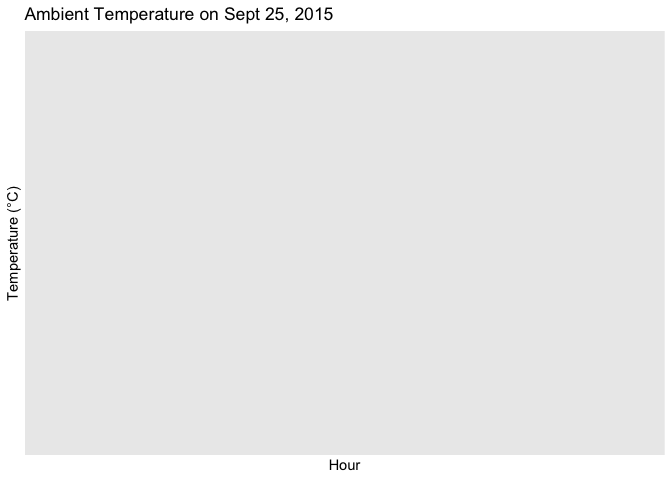

# assignment_6


# **Assignment 6: Data import and tidy data**

``` r
library(tidyverse)
```

    ── Attaching core tidyverse packages ──────────────────────── tidyverse 2.0.0 ──
    ✔ dplyr     1.1.4     ✔ readr     2.1.5
    ✔ forcats   1.0.0     ✔ stringr   1.5.1
    ✔ ggplot2   3.5.2     ✔ tibble    3.3.0
    ✔ lubridate 1.9.4     ✔ tidyr     1.3.1
    ✔ purrr     1.1.0     
    ── Conflicts ────────────────────────────────────────── tidyverse_conflicts() ──
    ✖ dplyr::filter() masks stats::filter()
    ✖ dplyr::lag()    masks stats::lag()
    ℹ Use the conflicted package (<http://conflicted.r-lib.org/>) to force all conflicts to become errors

``` r
library(knitr)
library(lubridate)
```

## Exercise 1. Tibble and Data Import

Import the data frames listed below into R and
[parse](https://r4ds.had.co.nz/data-import.html#parsing-a-vector) the
columns appropriately when needed. Watch out for the formatting oddities
of each dataset. Print the results directly, **without** using
`kable()`.

**You only need to finish any three out of the five questions in this
exercise in order to get credit.**

**1.1 Create the following tibble manually, first using `tribble()` and
then using `tibble()`. Print both results. \[We didn’t have time to
cover this in class, but look up how these functions work
[here](https://r4ds.had.co.nz/tibbles.html#creating-tibbles)\]**

``` r
trb_6 <- tribble(
  ~a, ~b, ~c,
  1, 2.1, "apple",
  2, 3.2, "orange")
trb_6
```

    # A tibble: 2 × 3
          a     b c     
      <dbl> <dbl> <chr> 
    1     1   2.1 apple 
    2     2   3.2 orange

``` r
tb_6 <- tibble(
  a = 1:2,
  b = c(2.1, 3.2), 
  c = c("apple", "orange"))
tb_6
```

    # A tibble: 2 × 3
          a     b c     
      <int> <dbl> <chr> 
    1     1   2.1 apple 
    2     2   3.2 orange

**1.2 Import
https://raw.githubusercontent.com/nt246/NTRES-6100-data-science/master/datasets/dataset2.txt
into R. Change the column names into “Name”, “Weight”, “Price”.**

``` r
data_2 <- read_delim("https://raw.githubusercontent.com/nt246/NTRES-6100-data-science/master/datasets/dataset2.txt", col_names = FALSE)
```

    Rows: 3 Columns: 3
    ── Column specification ────────────────────────────────────────────────────────
    Delimiter: ","
    chr (1): X1
    dbl (2): X2, X3

    ℹ Use `spec()` to retrieve the full column specification for this data.
    ℹ Specify the column types or set `show_col_types = FALSE` to quiet this message.

``` r
View(data_2)
colnames(data_2) <- c("Name", "Weight", "Price")
```

**1.4 Import
https://raw.githubusercontent.com/nt246/NTRES-6100-data-science/master/datasets/dataset4.txt
into R. Watch out for comments, units, and decimal marks (which are , in
this case).**

``` r
data_4 <- read_delim("https://raw.githubusercontent.com/nt246/NTRES-6100-data-science/master/datasets/dataset4.txt", delim = ";", comment = "#", locale = locale(decimal_mark = ",")) 
```

    Rows: 3 Columns: 1
    ── Column specification ────────────────────────────────────────────────────────
    Delimiter: ";"
    chr (1): Name Weight Price

    ℹ Use `spec()` to retrieve the full column specification for this data.
    ℹ Specify the column types or set `show_col_types = FALSE` to quiet this message.

``` r
View(data_4)
```

## Exercise 2. Weather station

This dataset contains the weather and air quality data collected by a
weather station in Taiwan. It was obtained from the Environmental
Protection Administration, Executive Yuan, R.O.C. (Taiwan).

### 2.1 Variable descriptions

- The text file
  https://raw.githubusercontent.com/nt246/NTRES-6100-data-science/master/datasets/2015y_Weather_Station_notes.txt
  contains descriptions of different variables collected by the station.

- Import it into R and print it in a table as shown below with kable().

``` r
taiwan <- read.delim("https://raw.githubusercontent.com/nt246/NTRES-6100-data-science/master/datasets/2015y_Weather_Station_notes.txt")
kable(taiwan)
```

| Item.Unit.Description |
|:---|
| AMB_TEMP-Celsius-Ambient air temperature |
| CO-ppm-Carbon monoxide |
| NO-ppb-Nitric oxide |
| NO2-ppb-Nitrogen dioxide |
| NOx-ppb-Nitrogen oxides |
| O3-ppb-Ozone |
| PM10-μg/m3-Particulate matter with a diameter between 2.5 and 10 μm |
| PM2.5-μg/m3-Particulate matter with a diameter of 2.5 μm or less |
| RAINFALL-mm-Rainfall |
| RH-%-Relative humidity |
| SO2-ppb-Sulfur dioxide |
| WD_HR-degress-Wind direction (The average of hour) |
| WIND_DIREC-degress-Wind direction (The average of last ten minutes per hour) |
| WIND_SPEED-m/sec-Wind speed (The average of last ten minutes per hour) |
| WS_HR-m/sec-Wind speed (The average of hour) |

### 2.2 Data tidying

- Import
  https://raw.githubusercontent.com/nt246/NTRES-6100-data-science/master/datasets/2015y_Weather_Station.csv
  into R. As you can see, this dataset is a classic example of untidy
  data: values of a variable (i.e. hour of the day) are stored as column
  names; variable names are stored in the item column.

- Clean this dataset up and restructure it into a tidy format.

- Parse the date variable into date format and parse hour into time.

- Turn all invalid values into NA and turn NR in rainfall into 0.

- Parse all values into numbers.

- Show the first 6 rows and 10 columns of this cleaned dataset, as shown
  below, without using kable().

``` r
datas_2 <- read.csv("https://raw.githubusercontent.com/nt246/NTRES-6100-data-science/master/datasets/2015y_Weather_Station.csv") |>
  mutate(across(everything(), ~str_trim(as.character(.)))) |>
  pivot_longer(-c(item, station), names_to="DateHour", values_to="Value") |>
  mutate(DateHour=str_remove(DateHour,"^X")) |>
  separate(DateHour, c("Date","Hour"), "H") |>
  mutate(Value=if_else(Value=="NR","0",na_if(Value,"-")),
         Date=ymd(Date), Hour=as.integer(Hour),
         Time=hms(paste0(str_pad(Hour,2,pad="0"),":00:00")),
         Value=as.numeric(Value)) |>
  pivot_wider(names_from=item, values_from=Value) |>
  rename(date=Date, station=station, hour=Time) |>
  arrange(station,date,hour)
```

    Warning: Expected 2 pieces. Missing pieces filled with `NA` in 136500 rows [1, 2, 3, 4,
    5, 6, 7, 8, 9, 10, 11, 12, 13, 14, 15, 16, 17, 18, 19, 20, ...].

    Warning: There were 3 warnings in `mutate()`.
    The first warning was:
    ℹ In argument: `Date = ymd(Date)`.
    Caused by warning:
    ! All formats failed to parse. No formats found.
    ℹ Run `dplyr::last_dplyr_warnings()` to see the 2 remaining warnings.

    Warning: Values from `Value` are not uniquely identified; output will contain list-cols.
    • Use `values_fn = list` to suppress this warning.
    • Use `values_fn = {summary_fun}` to summarise duplicates.
    • Use the following dplyr code to identify duplicates.
      {data} |>
      dplyr::summarise(n = dplyr::n(), .by = c(station, Date, Hour, Time, item)) |>
      dplyr::filter(n > 1L)

``` r
View(datas_2)
```

### 2.3 Using this cleaned dataset, plot the daily variation in ambient temperature on September 25, 2015, as shown below.

``` r
datas_2 |>
  filter(date=="2015-09-25", station=="Cailiao") |>
  ggplot(aes(hour, AMB_TEMP)) + 
  geom_line() +
  labs(title="Ambient Temperature on Sept 25, 2015", x="Hour", y="Temperature (°C)")
```



### 2.4 Plot the daily average ambient temperature throughout the year with a continuous line, as shown below.

### 2.5 Plot the total rainfall per month in a bar chart, as shown below.

Hint: separating date into three columns might be helpful.

### 2.6 Plot the per hour variation in PM2.5 in the first week of September with a continuous line, as shown below.

Hint: uniting the date and hour and parsing the new variable might be
helpful.
